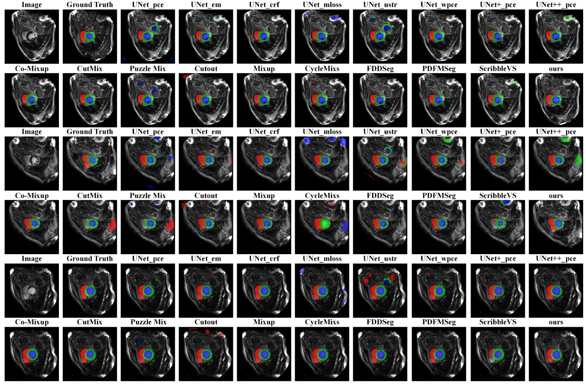
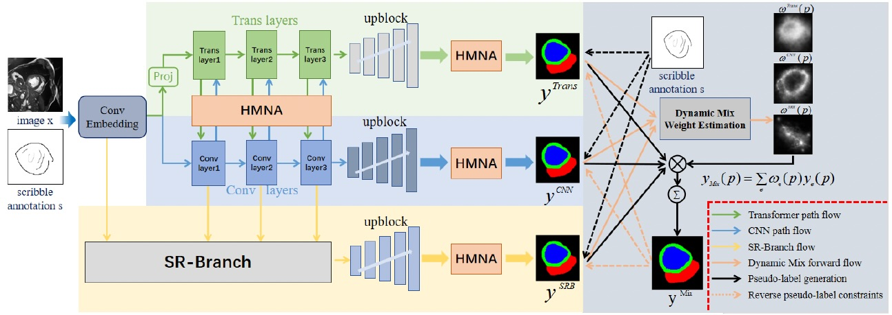

# From Sparse Scribbles to Accurate Cardiac MRI Segmentation: A Multi-Expert Dynamic Fusion Framework

[](https://pytorch.org/)
[](LICENSE)
[](https://python.org/)
[](https://github.com/psf/black)

---

## 📌 Overview

**S²RE-Net** is a state-of-the-art weakly supervised segmentation framework for cardiac MRI using **scribble annotations** only. Our method addresses the critical challenges of sparse supervision—response drift, boundary discontinuities, and missed thin-walled structures—through a novel three-expert collaborative architecture with dynamic fusion and closed-loop optimization.

This repository contains the official PyTorch implementation of the paper:

> **S²RE-Net: A Semantic Response Enhancement Network for Scribble-Supervised Cardiac MRI Segmentation**  
> *Md Abu Sufian, Mingbo Niu, et al.*  
> IEEE Transactions on Medical Imaging (TMI), 2025

---

## 🔥 Key Features

- ✅ **Three-Expert Collaborative Framework** – Transformer (global context) + CNN (local details) + SR-Branch (structural recovery)
- ✅ **Dynamic Mix** – Pixel-wise adaptive fusion with reverse pseudo-label closed-loop constraints
- ✅ **HMNA Block** – High-Order Multi-Scale Non-Local Attention for multi-scale contextual modeling
- ✅ **Scribble-Supervised** – Trains with only sparse scribble annotations, significantly reducing labeling cost
- ✅ **State-of-the-Art Performance** – Outperforms 17 methods on ACDC and MSCMRseg datasets
- ✅ **Fully Reproducible** – Includes code, configs, and evaluation scripts

---

## 📊 Results

### ACDC Dataset

| Method | Dice (RV) | Dice (MYO) | Dice (LV) | Dice (Avg) | Vol. Error ↓ |
|--------|-----------|------------|-----------|------------|--------------|
| S²RE-Net (Ours) | **0.8451** | **0.8468** | **0.9231** | **0.8717** | **0.1889** |
| CycleMix | 0.8266 | 0.7595 | 0.8269 | 0.8269 | 0.2446 |
| FDDSeg | 0.7984 | 0.7987 | 0.8831 | 0.8267 | 0.2011 |

### MSCMRseg Dataset

| Method | Dice (RV) | Dice (MYO) | Dice (LV) | Dice (Avg) | Vol. Error ↓ |
|--------|-----------|------------|-----------|------------|--------------|
| S²RE-Net (Ours) | **0.8547** | **0.7904** | **0.8978** | **0.8476** | **0.1073** |
| CycleMix | 0.7507 | 0.8162 | 0.8889 | 0.8186 | 0.2679 |
| FDDSeg | 0.7798 | 0.7039 | 0.8878 | 0.7905 | 0.2675 |

### Qualitative Comparison



*Predictions from UNet variants, mixing-based baselines and recent scribble-supervised methods compared with ours; red, green and blue denote RV, MYO and LV.*

---

## 🏗️ Architecture



*Shared Conv-Embedding feeds the Transformer, CNN and SR-Branch experts; each expert is refined by HMNA blocks, and Dynamic Mix estimates pixel-wise fusion weights with reverse pseudo-label constraints.*


```text
┌─────────────────────────────────────────────────────┐
│                    Shared Encoder                   │
│      Input → Conv Embed → Multi-Level Conv Blocks   │
└─────────────────────────┬───────────────────────────┘
                          │
        ┌─────────────────┼─────────────────┐
        ▼                 ▼                 ▼
┌─────────────────┐ ┌─────────────────┐ ┌─────────────────┐
│   Transformer   │ │       CNN       │ │    SR-Branch    │
│     Branch      │ │     Branch      │ │   (Structural   │
│ (Global Context)│ │ (Local Details) │ │    Recovery)    │
└────────┬────────┘ └────────┬────────┘ └────────┬────────┘
         └───────────────────┼───────────────────┘
                             ▼
              ┌─────────────────────────────┐
              │         Dynamic Mix         │
              │ (Pixel-Wise Adaptive Fusion │
              │   + Reverse Pseudo-Labels)  │
              └─────────────────────────────┘
                             ▼
              ┌─────────────────────────────┐
              │       Final Prediction      │
              └─────────────────────────────┘
```

**HMNA Block:** Multi-scale context dictionary → High-order non-local attention → Multi-receptive-field refinement → Adaptive fusion

---

## 🚀 Quick Start

### 1. Clone the Repository

```bash
git clone https://github.com/datascintist-abusufian/S2RE-Net.git
cd S2RE-Net
```

### 2. Set Up Environment

```bash
conda create -n s2renet python=3.9 -y
conda activate s2renet
pip install -r requirements.txt
```

`requirements.txt`:

```text
torch>=1.10.0
torchvision>=0.11.0
numpy>=1.21.0
opencv-python>=4.5.0
pillow>=8.0.0
tqdm>=4.60.0
tensorboard>=2.5.0
medpy>=0.4.0
simpleitk>=2.0.0
pyyaml>=5.4.0
scikit-learn>=0.24.0
scipy>=1.7.0
matplotlib>=3.3.0
```

### 3. Prepare Datasets

#### ACDC Dataset

```bash
# Download from: https://humanheart-project.creatis.insa-lyon.fr/database/#collection/637218c173e9f0047faa00fb
# Organize as:
data/acdc/
├── training/
│   ├── img/
│   └── scribble/
├── validation/
│   ├── img/
│   └── scribble/
└── testing/
    ├── img/
    └── scribble/
```

#### MSCMRseg Dataset

```bash
# Download from: https://zmiclab.github.io/zxh/0/mscmrseg19/
# Organize as:
data/mscmrseg/
├── training/
│   ├── img/
│   └── scribble/
├── validation/
│   ├── img/
│   └── scribble/
└── testing/
    ├── img/
    └── scribble/
```

### 4. Train the Model

```bash
# Training on ACDC
python train.py --config configs/acdc.yaml

# Training on MSCMRseg
python train.py --config configs/mscmrseg.yaml

# Multi-GPU training
python -m torch.distributed.launch --nproc_per_node=4 train.py --config configs/acdc.yaml --distributed
```

### 5. Evaluate the Model

```bash
python test.py --config configs/acdc.yaml --checkpoint checkpoints/best_model.pth
```

### 6. Visualize Results

```bash
python visualize.py --config configs/acdc.yaml --checkpoint checkpoints/best_model.pth --num_samples 10
```

---

## 📁 Repository Structure

```text
S2RE-Net/
├── configs/
│   ├── acdc.yaml              # ACDC configuration
│   └── mscmrseg.yaml          # MSCMRseg configuration
├── data/
│   └── README.md              # Dataset download instructions
├── models/
│   ├── __init__.py
│   ├── encoder.py             # Shared encoder
│   ├── branches.py            # Transformer, CNN, SR-Branch
│   ├── hmna.py                # HMNA block
│   ├── dynamic_mix.py         # Dynamic Mix module
│   └── s2renet.py             # Full S²RE-Net model
├── losses/
│   ├── __init__.py
│   ├── dice_loss.py
│   └── combined_loss.py       # Main + Aux + Rev losses
├── datasets/
│   ├── __init__.py
│   ├── acdc.py                # ACDC dataset loader
│   └── mscmrseg.py            # MSCMRseg dataset loader
├── utils/
│   ├── __init__.py
│   ├── metrics.py             # Dice, Sensitivity, Precision, Vol. Error
│   ├── logger.py              # TensorBoard logging
│   └── visualization.py       # Result visualization
├── train.py                   # Training script
├── test.py                    # Testing script
├── visualize.py               # Visualization script
├── requirements.txt
├── LICENSE
└── README.md                  # This file
```

---

## ⚙️ Configuration

Example `configs/acdc.yaml`:

```yaml
# Dataset
dataset: acdc
data_root: ./data/acdc
num_classes: 4
input_size: [256, 256]

# Training
epochs: 100
batch_size: 8
lr: 1e-3
weight_decay: 5e-4
optimizer: adamw
lr_scheduler: cosine
warmup_epochs: 5

# Loss Weights
lambda_aux: 0.3
lambda_rev: 0.2
confidence_threshold: 0.8

# Model
model:
  name: S2RENet
  in_channels: 1
  num_classes: 4
  base_channels: 64
  embed_dim: 256
  sr_channels: 256
  num_heads: 8
  num_trans_layers: 4
  hmna_reduction: 4

# Logging
log_dir: ./logs/acdc
checkpoint_dir: ./checkpoints/acdc
tensorboard: True
```

---

## 🧪 Evaluation Metrics

We report the following metrics in our experiments:

| Metric | Description |
|--------|-------------|
| Dice Score | Dice similarity coefficient per structure (RV, MYO, LV) and average |
| Sensitivity | True positive rate (recall) |
| Precision | Positive predictive value |
| Volume Error | Absolute volume difference normalized by ground truth volume |

---

## 📝 Citation

If you find this code useful for your research, please cite our paper:

```bibtex
@article{sufian2025s2renet,
  title={S$^2$RE-Net: A Semantic Response Enhancement Network for Scribble-Supervised Cardiac MRI Segmentation},
  author={Sufian, Md Abu and Niu, Mingbo and Anonymous},
  journal={IEEE Transactions on Medical Imaging},
  year={2025},
  publisher={IEEE}
}
```

BibTeX (BibLaTeX style):

```bibtex
@article{sufian2025s2renet,
  author  = {Sufian, Md Abu and Niu, Mingbo and Anonymous},
  title   = {S$^2$RE-Net: {A} Semantic Response Enhancement Network for Scribble-Supervised Cardiac {MRI} Segmentation},
  journal = {IEEE Transactions on Medical Imaging},
  year    = {2025},
  volume  = {},
  number  = {},
  pages   = {},
  doi     = {},
  issn    = {}
}
```

---

## 📧 Contact

For questions, suggestions, or collaboration inquiries, please:

- Open an issue on GitHub
- Email: author@email.com

---

## 📄 License

This project is licensed under the MIT License - see the LICENSE file for details.

---

## 🙏 Acknowledgments

- ACDC dataset organizers: Human Heart Project
- MSCMRseg dataset organizers: Zhongxing Zhuang's Lab
- This work was supported by the IVR Research Institute

---

## 🌟 Star History

If you find this repository useful, please give it a ⭐ star! It helps others discover the project.

---

## 📖 Additional Resources

- 📄 Paper (arXiv)
- 📄 IEEE TMI Publication
- 📊 Model Weights
- 🎬 Demo Video

---

Built with ❤️ by the IVR Research Institute
